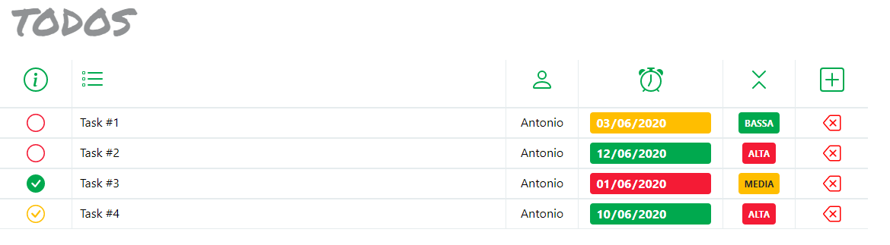

# todos
Simple todo list based on Svelte framework.

I have developed it to learn Svelte and I am using it for my day to day work.

Currently it uses localStorage to save tasks. Next release should be able to use a REST API backend.


# run it

First install the dependencies...

```bash
cd todos
npm install
```

the run it

```bash
npm run dev
```

Now you can navigate to [localhost:5000](http://localhost:5000). You should see your app running in your browser.


 